<div align="center">

# Usman Nadeem · Portfolio

**Software Architect at Legit Design Studio.** I build the app, the API and everything between.

<!-- After deploying, find and replace "your-site.vercel.app" with your Vercel address everywhere in this file. -->
### [Visit the live site →](https://your-site.vercel.app)


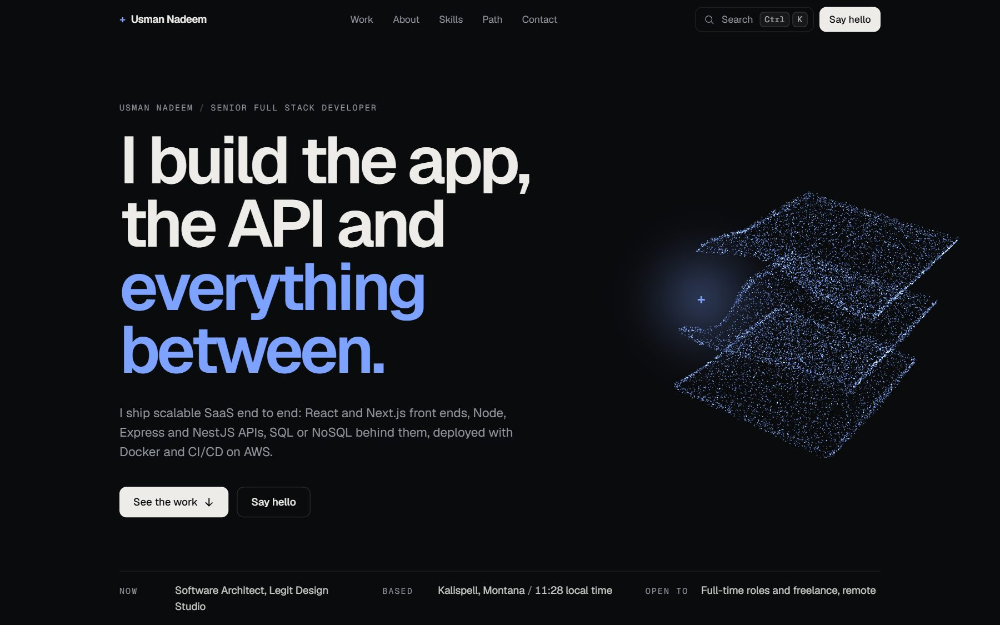

</div>

## About this site

A single-page portfolio for my product work: mobile apps, SaaS platforms and custom business software. Every project gets its own scroll-driven showcase, built around real screens of the product, so no two projects move the same way. Behind the page, one three.js particle cloud reshapes itself for each section.

## Selected work

<table>
  <tr>
    <td width="50%" valign="top">
      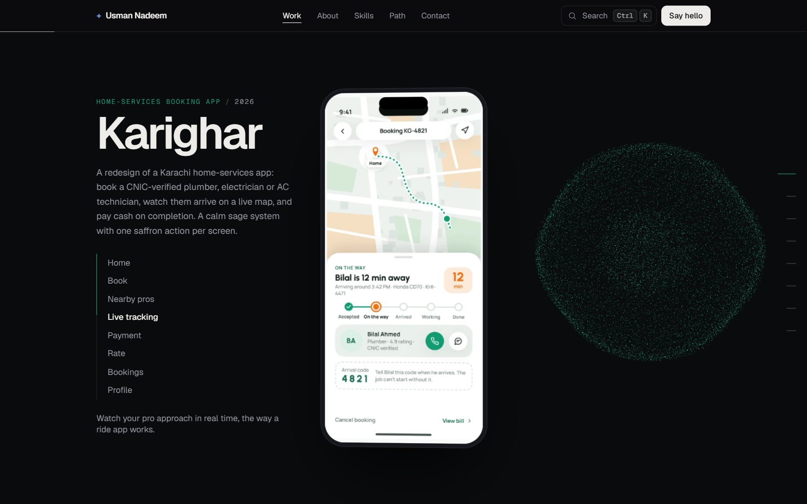
      <br><b>Karighar</b> · Home-services booking app
      <br><sub>A pinned phone steps through eight screens as you scroll, from booking to live tracking to payment.</sub>
    </td>
    <td width="50%" valign="top">
      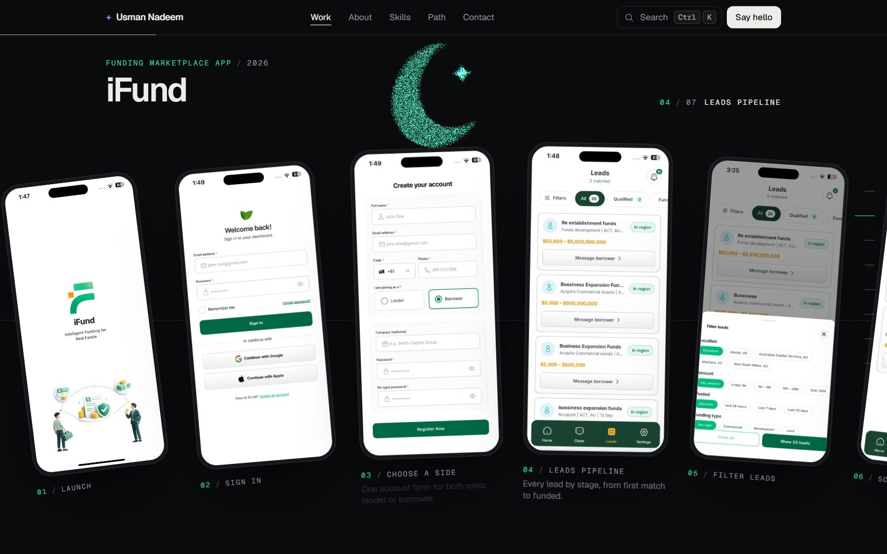
      <br><b>iFund</b> · Funding marketplace app
      <br><sub>The whole app flow as a row of phones sliding sideways. Each phone stands up straight as it reaches the centre.</sub>
    </td>
  </tr>
  <tr>
    <td width="50%" valign="top">
      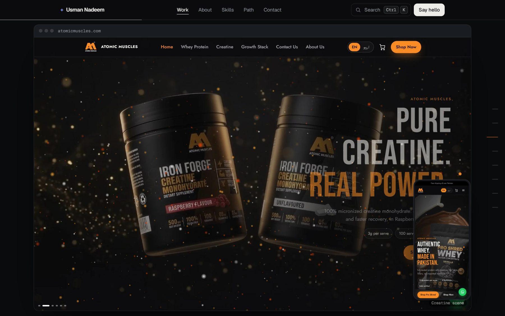
      <br><b>Atomic Muscles</b> · 3D e-commerce store
      <br><sub>A browser window lays flat from a 3D tilt and grows to fill the screen, cycling through the live store. The phone layout slides in last.</sub>
    </td>
    <td width="50%" valign="top">
      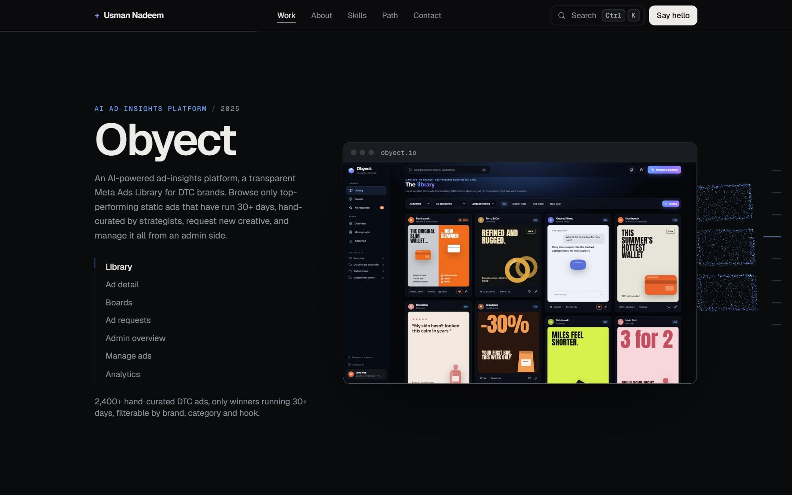
      <br><b>Obyect</b> · AI ad-insights platform
      <br><sub>A pinned browser window scrubs through seven screens of the ad library and admin, with a progress rail.</sub>
    </td>
  </tr>
  <tr>
    <td width="50%" valign="top">
      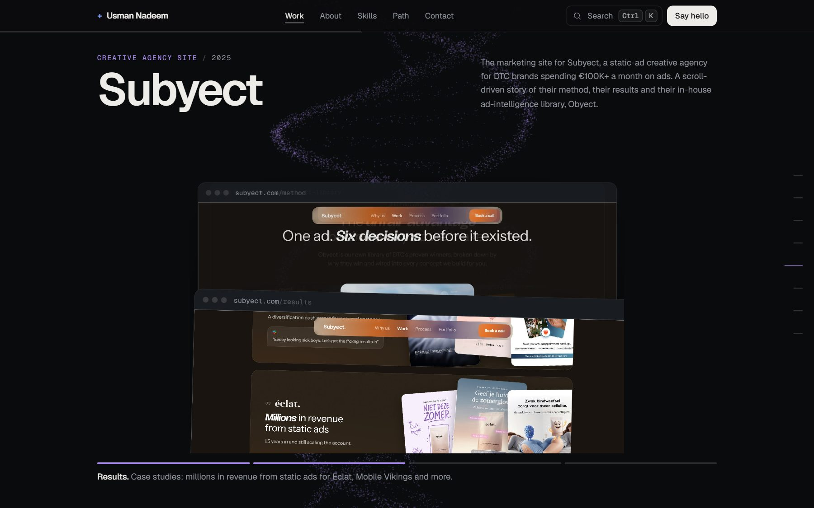
      <br><b>Subyect</b> · Creative agency site
      <br><sub>The site as a pile of pages. The front page lifts, tilts and slides away to bring the next one forward.</sub>
    </td>
    <td width="50%" valign="top">
      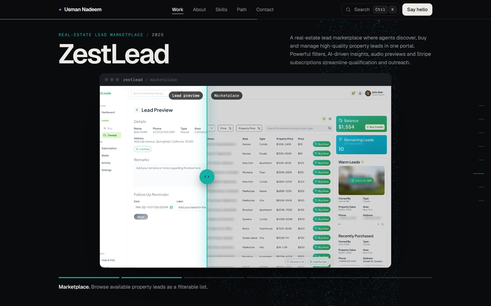
      <br><b>ZestLead</b> · Real-estate lead marketplace
      <br><sub>One window. Each screen wipes across the last behind a lit divider with a handle, like a before-and-after slider.</sub>
    </td>
  </tr>
  <tr>
    <td width="50%" valign="top">
      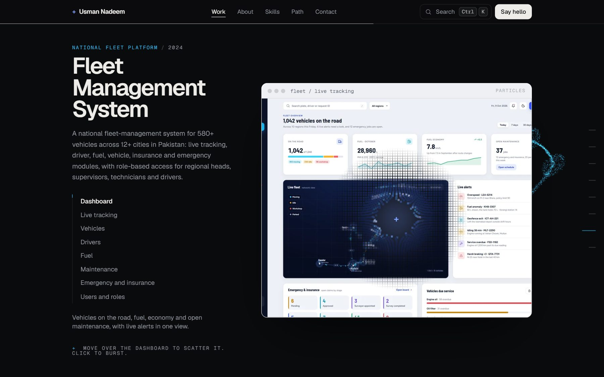
      <br><b>Fleet Management System</b> · National fleet platform
      <br><sub>The dashboard is rebuilt from about 10,000 particles. Hover to scatter them, click to burst. New screens open with a radar ping.</sub>
    </td>
    <td width="50%" valign="top">
      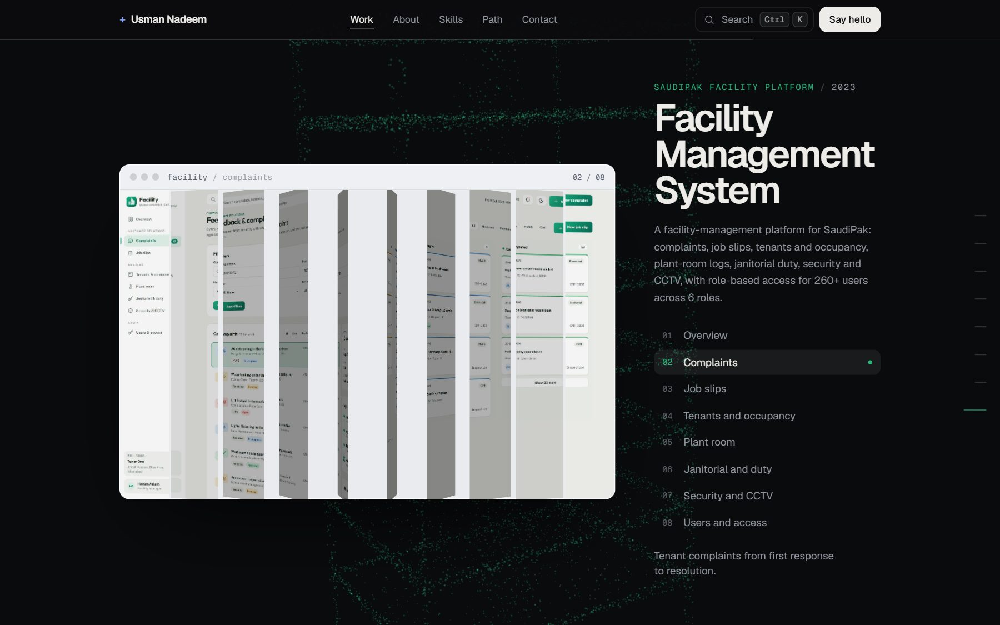
      <br><b>Facility Management System</b> · SaudiPak facility platform
      <br><sub>Ten vertical slats turn over between modules, like louvres on a tower. The module list jumps to any screen.</sub>
    </td>
  </tr>
</table>

Each showcase is followed by my role, the stack, and every feature the product shipped with.

## Also on the page

<table>
  <tr>
    <td width="50%" valign="top">
      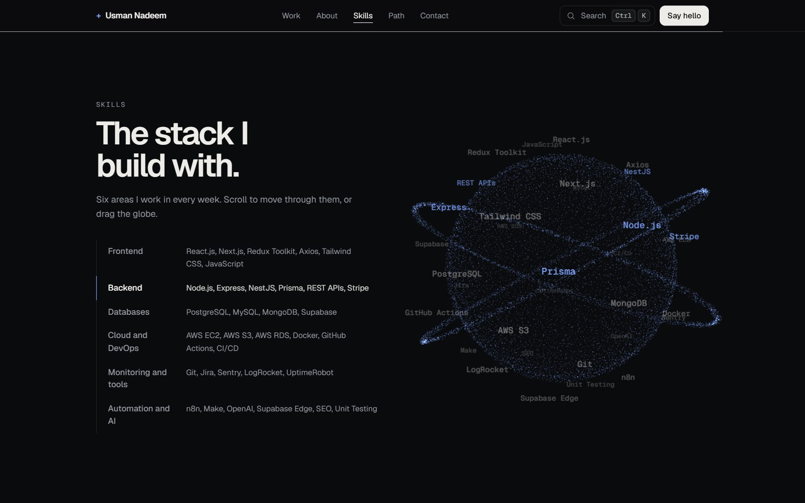
      <br><b>Skills globe</b>
      <br><sub>Every skill sits on a sphere that spins, tilts to the active group as you scroll, and can be dragged.</sub>
    </td>
    <td width="50%" valign="top">
      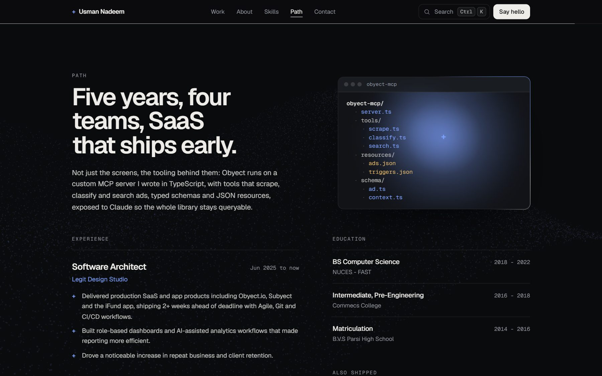
      <br><b>Path</b>
      <br><sub>Experience and education, with a code window whose border light sweeps around it and a spotlight that follows the cursor.</sub>
    </td>
  </tr>
  <tr>
    <td width="50%" valign="top">
      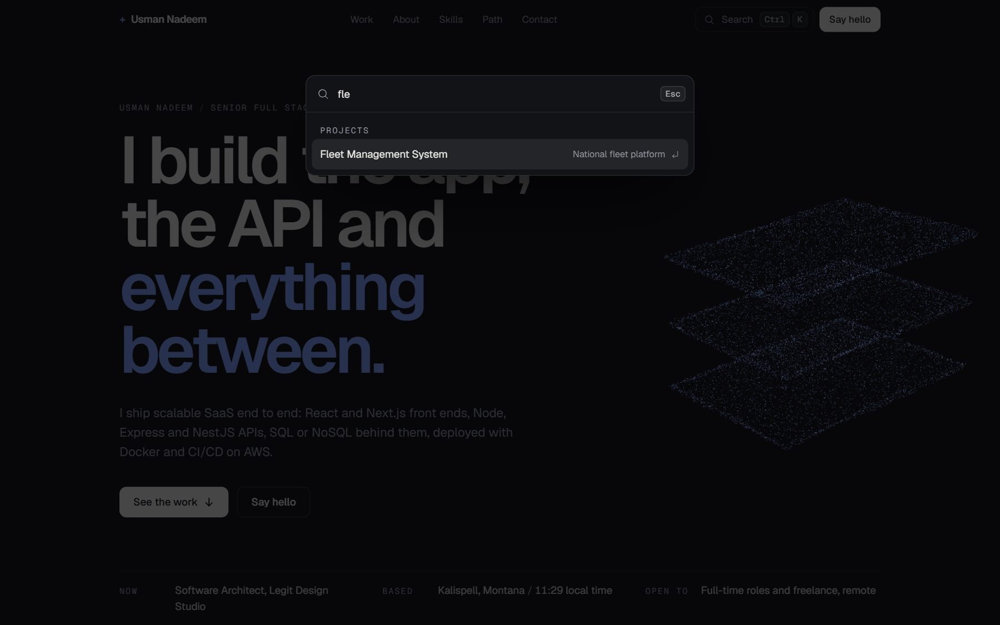
      <br><b>Command palette</b>
      <br><sub>Press <kbd>Ctrl</kbd> <kbd>K</kbd>, <kbd>⌘</kbd> <kbd>K</kbd> or <kbd>/</kbd> to jump to any section or project, copy the email or open a link.</sub>
    </td>
    <td width="50%" valign="top">
      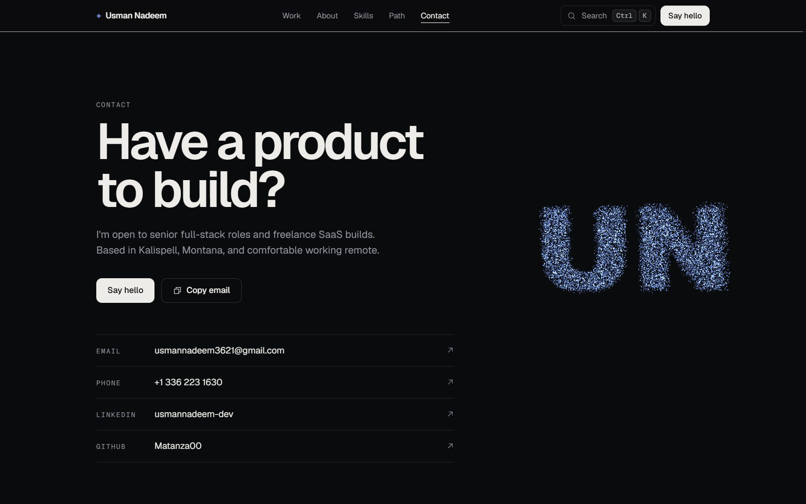
      <br><b>Contact</b>
      <br><sub>Email, phone and profiles, with my monogram drawn by the particle cloud.</sub>
    </td>
  </tr>
</table>

## On a phone

<p align="center">
  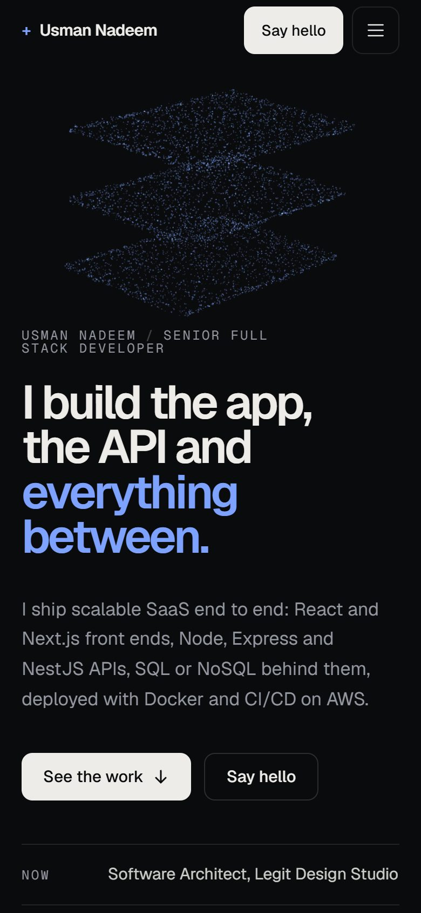
  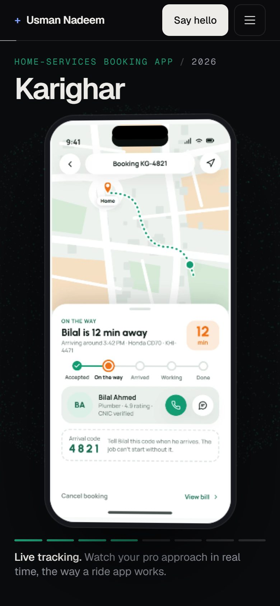
  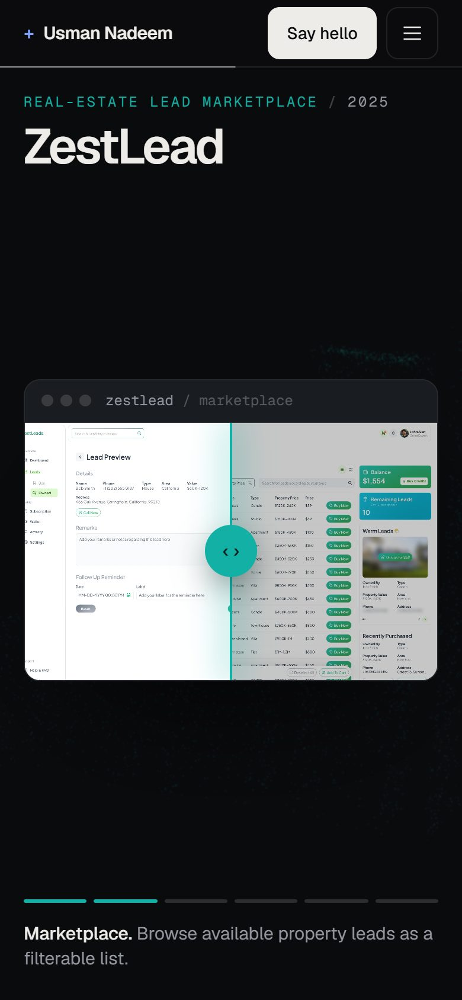
  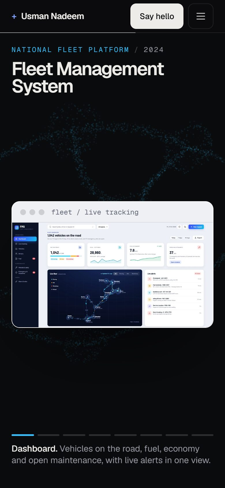
</p>

Every showcase has a phone layout, and touch devices get a lighter particle field.

## Features

- **Particle field.** One three.js draw call of about 18,000 points (7,000 on touch devices) that morphs into a different shape for each section: a stack, an orb, a helix, a road network, a tower, a globe and a monogram.
- **Eight showcase styles.** No two projects use the same scroll animation.
- **Custom cursor.** A blue plus with a soft trailing glow on mouse and trackpad. Touch devices and text fields keep the normal cursor.
- **Navigation.** The header marks the current section and keeps the URL in sync, so any project can be linked to directly. A side rail on wide screens jumps between projects.
- **Smooth scrolling** with Lenis on desktop, and native scrolling on touch devices.
- **Reduced motion and no-WebGL support.** Without WebGL, or with reduced motion turned on, there's no canvas and nothing is pinned. Every screen still shows.
- **Fast first load.** The page is prerendered as static HTML, and project media waits until its section is close.

## Tech stack

| Area | Tools |
| --- | --- |
| Framework | Next.js 16 (App Router, static prerender), React 19 |
| 3D | three.js through React Three Fiber, custom GLSL shaders |
| Animation | Motion (scroll-linked transforms), Lenis smooth scroll |
| Styling | Tailwind CSS 3 with CSS variables for per-project accent colours |
| Icons and fonts | Phosphor Icons, Geist and Geist Mono |
| Hosting | Vercel |

## Run it locally

You need Node.js 20 or newer.

```bash
npm install
npm run dev
```

Then open http://localhost:3000.

For a production build:

```bash
npm run build
npm run start
```

## Deploy to Vercel

1. Push this repository to GitHub.
2. On [vercel.com/new](https://vercel.com/new), import the repository. Vercel detects Next.js, and the default settings work as they are. No environment variables are needed.
3. After the first deploy, put your site address into `SITE_URL` in `lib/site.js`. Link previews and search results use it. Then replace `https://your-site.vercel.app` in this README.

Every push to the main branch redeploys the site.

## Editing the content

| What | Where |
| --- | --- |
| Projects: copy, screens, stack, links, accent colour, particle shape | `lib/projects.js` |
| Project order on the page | `ORDER` at the bottom of `lib/projects.js` |
| About text, skills, experience, education | `lib/profile.js` |
| Site address, email, phone, social links | `lib/site.js` |
| Project screens and captures | `public/work/<project>/` |
| README screenshots | `docs/screenshots/` |

## Project structure

```text
app/                  layout, page and global styles
components/
  field/              the three.js particle field and its shapes
  showcase/           one component per showcase style
  site/               header, hero, sections, skills globe, palette, cursor
  motion/             smooth scroll, reveal animation and hooks
lib/                  projects, profile and site settings
public/work/          app screens and site captures
docs/screenshots/     images used in this README
```

The `.html` files at the root are standalone design prototypes. The project screens were captured from them.

## Contact

- **Email:** [usmannadeem3621@gmail.com](mailto:usmannadeem3621@gmail.com)
- **LinkedIn:** [usmannadeem-dev](https://www.linkedin.com/in/usmannadeem-dev)
- **GitHub:** [Matanza00](https://github.com/Matanza00)
- **Live site:** [your-site.vercel.app](https://your-site.vercel.app)
